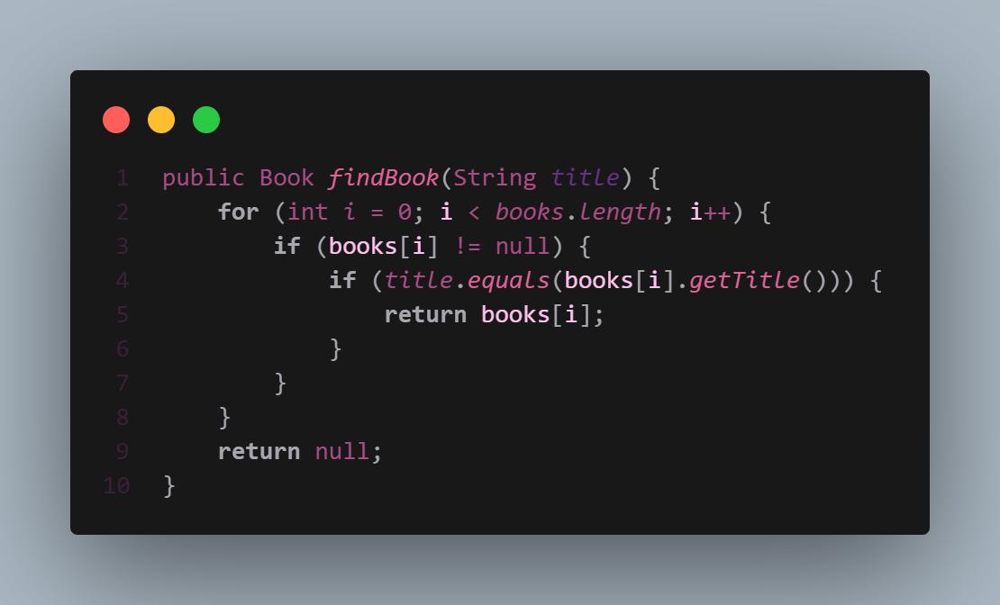
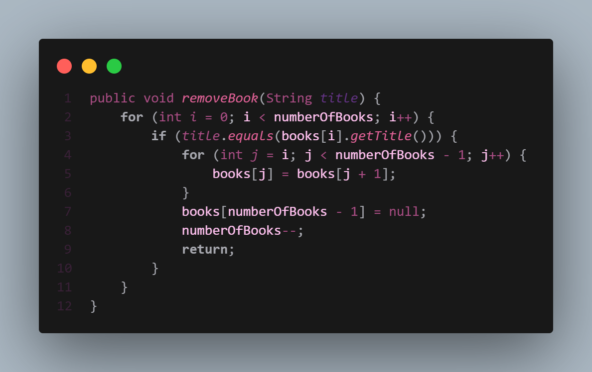
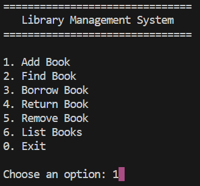
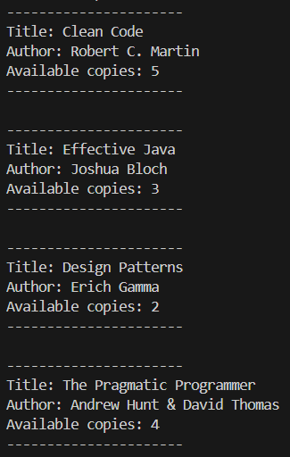
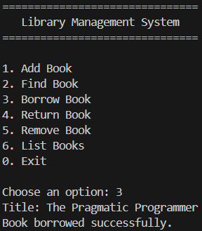

# 📚 Library Management System

> A simple console-based application developed in Java to practice and improve Object-Oriented Programming (OOP) concepts.

A console-based **Library Management System** developed in **Java** to reinforce the fundamentals of **Object-Oriented Programming (OOP)**.

The application simulates common library operations while emphasizing clean code, object interaction, encapsulation, and separation of responsibilities.

---

## ✨ Features

- 📖 Add new books
- 🔍 Search books by title
- 📚 Borrow books
- ↩️ Return borrowed books
- ❌ Remove books
- 📋 List all registered books
- ✅ Input validation
- ⚠️ Exception handling
- 🖥️ Interactive console menu

---

## 🛠️ Technologies

- Java
- Object-Oriented Programming (OOP)

---

## 📂 Project Structure

```text
src/
├── Main.java
├── app/
│   └── App.java
└── Library/
    ├── Book.java
    └── Library.java
```

### Class Responsibilities

| Class | Responsibility |
| ----------- | ---------------------------------------------------------- |
| **Book** | Represents a single book and manages its available copies. |
| **Library** | Stores and manages the collection of books. |
| **App** | Handles user interaction and menu navigation. |
| **Main** | Entry point of the application. |

---

## 💻 Code Preview

Example of the `findBook()` implementation.



Example of the `removeBook()` implementation.



---

## 📸 Application Preview

### Main Menu



---

### Listing Books



---

### Borrowing a Book



---

## 🧠 Concepts Practiced

- Object-Oriented Programming
- Classes and Objects
- Encapsulation
- Constructors
- Object References
- Searching Algorithms
- Collections Framework (`ArrayList`)
- Data Structures
- Method Design
- Separation of Responsibilities
- Input Validation
- Exception Handling
- Console Applications
- Control Structures (`if`, `switch`, `for`, `do-while`)

---

## 🚀 Running the Project

Clone the repository:

```bash
git clone https://github.com/DeviRexVi/library-management-system.git
```

Compile the project:

```bash
javac -d bin src/Main.java src/app/App.java src/Library/*.java
```

Run the application:

```bash
java -cp bin Main
```

---

## 🔮 Future Improvements

This project will continue to evolve as I practice new Java concepts and improve its design.

Some planned improvements include:

- Improve user interface and user experience
- Add more advanced search and filtering options
- Implement automated tests with JUnit
- Data persistence
- Refactoring packages following Java conventions

---

## 👨‍💻 Author

**Davi Rexhausen Vieira**

Software Engineering Student

GitHub: **https://github.com/DeviRexVi**

---

## 📄 License

This project is intended for educational purposes.