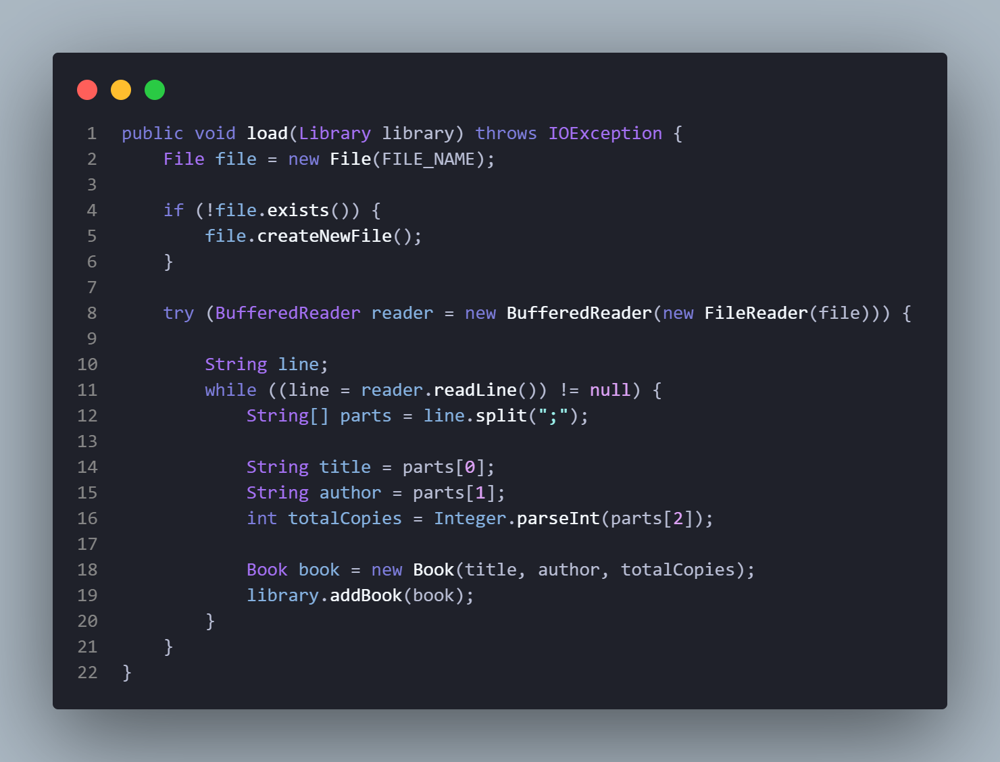
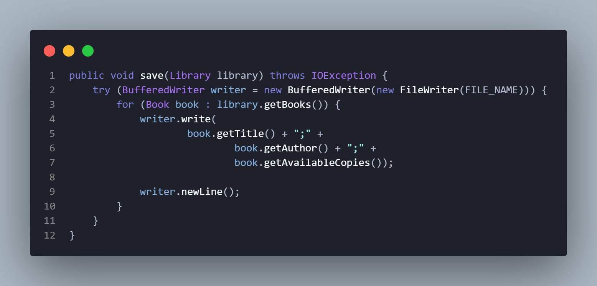
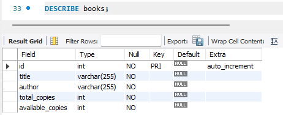
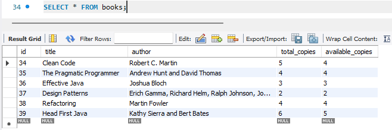
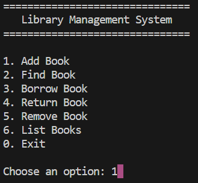
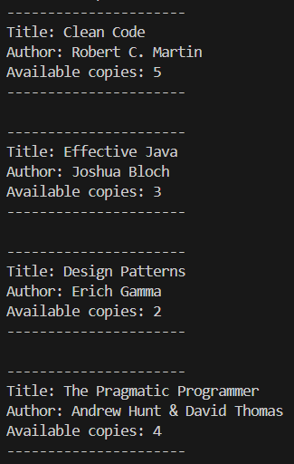
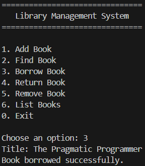

# 📚 Library Management System

> A console-based Library Management System developed in Java to practice Object-Oriented Programming, clean code principles, software design, and different persistence strategies.

This project simulates the core operations of a library while focusing on **Object-Oriented Programming (OOP)**, **clean code**, **software design**, and **continuous refactoring**.

Rather than being a one-time project, it serves as a practical environment where I apply new Java concepts and improve the architecture as the project evolves.

The project started with file-based persistence and was later expanded with database support using JDBC, allowing different persistence implementations through abstraction.

---

## ✨ Features

- 📖 Add new books
- 🔍 Search books by title or by title and author
- 📚 Borrow books
- ↩️ Return borrowed books
- ❌ Remove books
- 📋 List all registered books
- 🔄 Automatically merge duplicate books by increasing copies
- ✅ Input validation
- ⚠️ Exception handling
- 🛡️ Domain validation using `IllegalArgumentException`
- 🧩 Persistence abstraction through interfaces
- 📄 File-based persistence
- 🗄️ Database persistence using JDBC
- 💾 Automatic saving and loading of library data
- 🖥️ Interactive console menu

---

## 🛠️ Technologies

- Java
- Object-Oriented Programming (OOP)
- Java Collections Framework (`ArrayList`)
- Java I/O
- JDBC
- SQL
- MySQL
- Maven
- Git & GitHub

---

## 📂 Project Structure

```text
src/
└── main/
    ├── java/
    │   ├── Main.java
    │   ├── app/
    │   │   └── App.java
    │   └── Library/
    │       ├── Book.java
    │       ├── Library.java
    │       ├── Persistence.java
    │       ├── LibraryPersistence.java
    │       └── DatabasePersistence.java
    │
    └── resources/
        ├── database.properties.example
        └── database-schema.sql
```

---

## 🧩 Class Responsibilities

| Class                   | Responsibility                                                                                |
| ----------------------- | --------------------------------------------------------------------------------------------- |
| **Book**                | Represents a book entity and protects its own state through domain validation.                |
| **Library**             | Manages the collection of books and contains business rules, such as merging duplicate books. |
| **Persistence**         | Defines the contract for persistence implementations.                                         |
| **LibraryPersistence**  | Implements file-based persistence for saving and loading library data.                        |
| **DatabasePersistence** | Implements database persistence using JDBC.                                                   |
| **App**                 | Handles user interaction, input validation, and menu navigation.                              |
| **Main**                | Application entry point.                                                                      |

---

## 🗄️ Database Configuration

The project supports database persistence using JDBC and MySQL.

Before using the database persistence implementation:

1. Create a MySQL database.
2. Execute the schema file:

```text
src/main/resources/database-schema.sql
```

3. Create a `database.properties` file based on:

```text
src/main/resources/database.properties.example
```

Example:

```properties
url=jdbc:mysql://localhost:3306/library
user=your_username
password=your_password
```

The real `database.properties` file is ignored by Git to prevent exposing sensitive information.

---

## 📸 Screenshots

### 💻 Code

Example of the `load()` implementation.



Example of the `save()` implementation.



---

### 🗄️ Database

Database structure and stored library data using MySQL.



Example of the books table containing persisted data.



---

### 🖥️ Application

#### Main Menu



#### Listing Books



#### Borrowing a Book



---

## 🧠 Concepts Practiced

- Object-Oriented Programming
- Classes and Objects
- Encapsulation
- Constructors
- Method Overloading
- Interfaces
- Polymorphism
- Object References
- Collections Framework (`ArrayList`)
- File I/O
- JDBC
- SQL Database Integration
- Data Persistence
- Prepared Statements
- Try-with-resources
- Exception Handling
- Input Validation
- Defensive Programming
- Domain Validation
- Separation of Responsibilities
- Programming to Interfaces
- Refactoring and clean code practices
- Console Applications
- Git Branching and Incremental Development

---

## 🚀 Running the Project

Clone the repository:

```bash
git clone https://github.com/DeviRexVi/library-management-system.git
```

Build the project using Maven:

```bash
mvn clean package
```

Run the application:

```bash
java -jar target/library-management-system-1.0.0.jar
```

---

## 🔮 Future Improvements

This project will continue evolving as I practice new Java concepts and improve my software design skills.

Planned improvements include:

- 🧪 Expanding unit tests with JUnit
- 🔎 Improving search and filtering features
- 🔃 Sorting books by different criteria
- 🖥️ Creating a graphical user interface with JavaFX
- 📦 Improving package structure following Java conventions
- 🌐 Developing a REST API version

---

## 👨‍💻 Author

**Davi Rexhausen Vieira**

Software Engineering Student

GitHub: **https://github.com/DeviRexVi**

---

## 📄 License

This project is intended for educational purposes.
